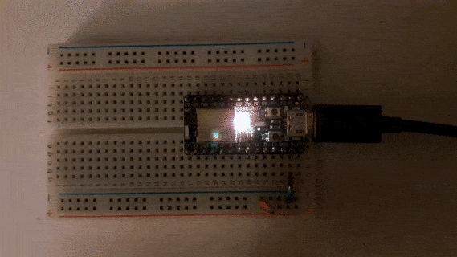

### APA102 BLINK EXAMPLE

Ported to the Adafruit ItsyBitsy nRF52840 Express board (https://learn.adafruit.com/adafruit-itsybitsy-nrf52840-express) from these two examples:
* https://github.com/smart-leds-rs/smart-leds-samples/blob/master/trinket-m0-examples/examples/trinket_apa102_onboard_blink.rs
* https://github.com/nrf-rs/nrf-hal/blob/master/examples/spi-demo/src/main.rs



### HOW TO FLASH:

* build the code: ```cargo build --release```
* convert to .hex file: ```arm-none-eabi-objcopy -O ihex target/thumbv7em-none-eabihf/release/blinky_neopixel neopixel.hex```
* create a dfu package: ```adafruit-nrfutil dfu genpkg --dev-type 0x0052 --application neopixel.hex neopixel.zip```
* put the board into bootloader mode (double click on reset button, will show up as _ITSY840BOOT_ or similar)
* flash the firmware: ```adafruit-nrfutil dfu serial --package neopixel.zip -p /dev/ttyACM0 -b 115200```
